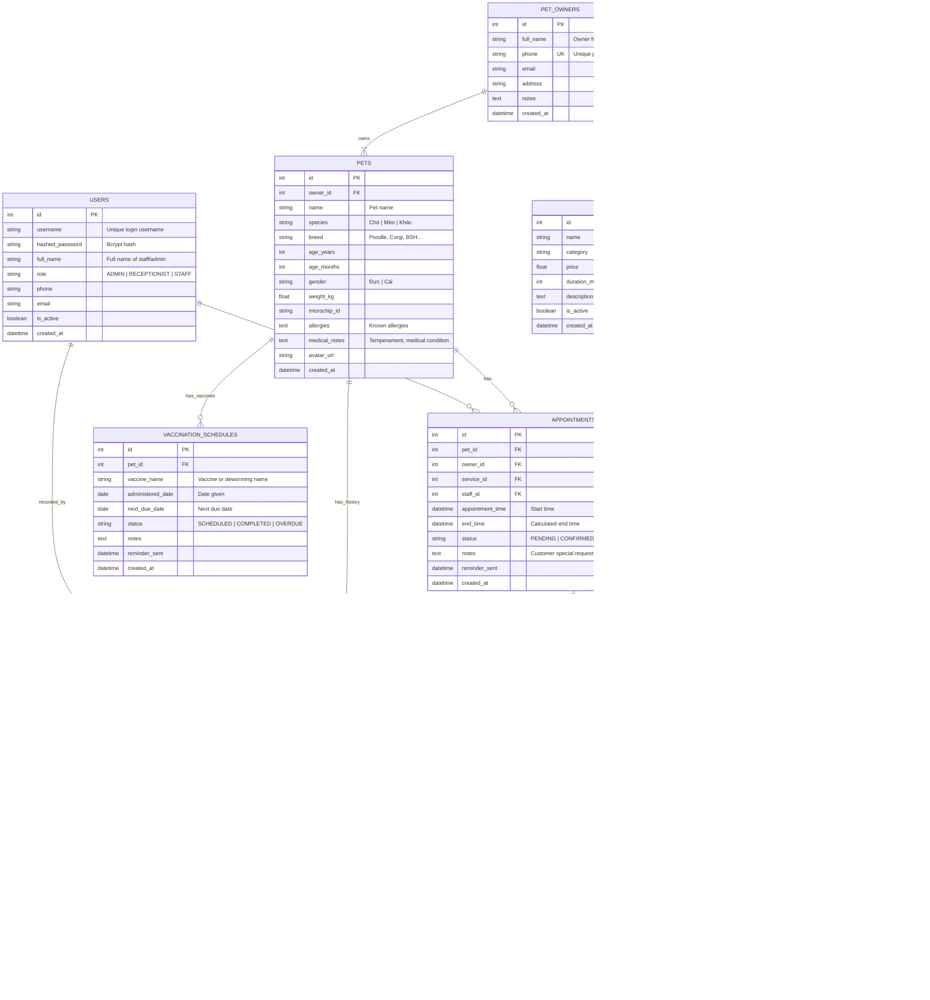

# SƠ ĐỒ THỰC THỂ QUAN HỆ (ERD) - PETCARE AI PRO
**Học phần:** Ứng dụng trí tuệ nhân tạo (AIA331) - Đề tài: 80286

```mermaid
erDiagram
    USERS ||--o{ APPOINTMENTS : "assigned_to"
    USERS ||--o{ CARE_RECORDS : "recorded_by"
    
    PET_OWNERS ||--|{ PETS : "owns"
    PET_OWNERS ||--o{ INVOICES : "billed_to"
    
    PETS ||--o{ APPOINTMENTS : "has"
    PETS ||--o{ CARE_RECORDS : "has_history"
    PETS ||--o{ VACCINATION_SCHEDULES : "has_vaccines"
    
    SERVICES ||--o{ APPOINTMENTS : "booked_service"
    
    APPOINTMENTS ||--o| INVOICES : "generates"
    APPOINTMENTS ||--o| CARE_RECORDS : "produces"
    
    INVOICES ||--|{ INVOICE_ITEMS : "contains"

    USERS {
        int id PK
        string username "Unique login username"
        string hashed_password "Bcrypt hash"
        string full_name "Full name of staff/admin"
        string role "ADMIN | RECEPTIONIST | STAFF"
        string phone
        string email
        boolean is_active
        datetime created_at
    }

    PET_OWNERS {
        int id PK
        string full_name "Owner full name"
        string phone UK "Unique phone number"
        string email
        string address
        text notes
        datetime created_at
    }

    PETS {
        int id PK
        int owner_id FK
        string name "Pet name"
        string species "Chó | Mèo | Khác"
        string breed "Poodle, Corgi, BSH..."
        int age_years
        int age_months
        string gender "Đực | Cái"
        float weight_kg
        string microchip_id
        text allergies "Known allergies"
        text medical_notes "Temperament, medical condition"
        string avatar_url
        datetime created_at
    }

    SERVICES {
        int id PK
        string name "Service title"
        string category "Tắm spa, Grooming, Tiêm phòng, Lưu trú, Combo"
        float price "Price in VND"
        int duration_minutes "Estimated duration"
        text description
        boolean is_active
        datetime created_at
    }

    APPOINTMENTS {
        int id PK
        int pet_id FK
        int owner_id FK
        int service_id FK
        int staff_id FK
        datetime appointment_time "Start time"
        datetime end_time "Calculated end time"
        string status "PENDING | CONFIRMED | IN_PROGRESS | COMPLETED | CANCELLED"
        text notes "Customer special requests"
        datetime reminder_sent
        datetime created_at
    }

    CARE_RECORDS {
        int id PK
        int pet_id FK
        int appointment_id FK
        int staff_id FK
        datetime record_date
        float weight_kg "Recorded weight"
        string coat_skin_condition "Skin & coat condition"
        string ears_eyes_teeth "Ears, eyes, dental check"
        string behavior_mood "Behavior & cooperation"
        text services_performed
        text notes "Caregiver advice for pet owner"
        string before_photo_url
        string after_photo_url
        datetime created_at
    }

    VACCINATION_SCHEDULES {
        int id PK
        int pet_id FK
        string vaccine_name "Vaccine or deworming name"
        date administered_date "Date given"
        date next_due_date "Next due date"
        string status "SCHEDULED | COMPLETED | OVERDUE"
        text notes
        datetime reminder_sent
        datetime created_at
    }

    INVOICES {
        int id PK
        string invoice_code UK "INV-YYYYMMDD-XXX"
        int appointment_id FK
        int owner_id FK
        float subtotal "Total before discounts"
        float discount_amount "Discount applied"
        float tax_amount "VAT"
        float total_amount "Final payable amount"
        string payment_method "Tiền mặt | Chuyển khoản / QR | Thẻ POS"
        string payment_status "Chưa thanh toán | Đã thanh toán | Đã hoàn tiền"
        datetime payment_time
        text notes
        datetime created_at
    }

    INVOICE_ITEMS {
        int id PK
        int invoice_id FK
        string item_name
        int quantity
        float unit_price
        float total_price
    }
```
